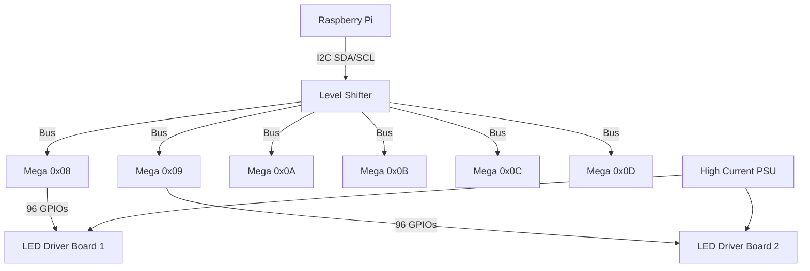

# Hardware Setup & Wiring Guide

## 1. System Overview
- **Master**: Raspberry Pi 3B+/4B (3.3V Logic)
- **Slaves**: 6x Arduino Mega 2560 (5V Logic)
- **Display**: 576 LEDs (12 driver boards)

> [!WARNING]
> **Logic Level Voltage Mismatch**: The Raspberry Pi uses 3.3V I2C logic, while the Arduino Mega uses 5V. **You must use a Bi-Directional Logic Level Converter (3.3V <-> 5V) on the SDA/SCL lines to prevent damaging the Pi.**

## 2. I2C Bus Wiring
All devices share the same SDA/SCL lines. The Pi is the Master.

| Signal | Raspberry Pi (GPIO Header) | Level Shifter | Arduino Mega (Pin) |
|--------|----------------------------|---------------|-------------------|
| **SDA**| Pin 3 (GPIO 2)             | 3.3V <-> 5V   | Pin 20 (SDA)      |
| **SCL**| Pin 5 (GPIO 3)             | 3.3V <-> 5V   | Pin 21 (SCL)      |
| **GND**| Pin 6 (GND)                | GND           | GND               |

**Pull-Up Resistors**:
- The I2C bus requires pull-up resistors.
- Place **4.7kΩ resistors** from SDA to 5V and SCL to 5V (on the Arduino side of the level shifter). 
- *Note: Some level shifters include built-in pull-ups.*

## 3. Power Strategy (Critical)
To handle the high current requirements of 576 LEDs and ensure stability:
1.  **Logic Power (5V)**:
    - Use a stable 5V USB hub or PSU to power the Raspberry Pi and the 6 Arduino Megas via their USB ports or 5V pins.
2.  **LED Power (High Current)**:
    - Use a separate high-current PSU (e.g., 5V 20A or 40A depending on LED specs) to power the LED driver boards directly.
    - **DO NOT** sink the LED current through the Arduino pins. Use the transistor driver boards.
3.  **Common Ground**:
    - **ALL** power supplies (Logic PSU + LED PSU) must share a common ground (GND). This is essential for I2C and signal reliability.

## 4. Pin Mapping (Ribbon Cables)
The existing Esser ribbons likely group LEDs in clusters.
1.  Identify the 96 LEDs controlled by one ribbon/driver set.
2.  Connect the ribbon signal wires to the Mega Digital Pins 2-53 and Analog Pins A0-A15.
3.  Use the `firmware/SlaveController.ino` file to map logical indices (0-95) to the physical pins connected.

