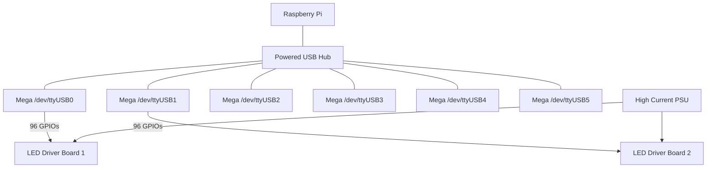

# Hardware Setup & Wiring Guide

## 1. System Overview
- **Master**: Raspberry Pi 3B+/4B (3.3V Logic)
- **Slaves**: 6x Arduino Mega 2560 (5V Logic)
- **Display**: 576 LEDs (12 driver boards)

> [!TIP]
> **Serial Connectivity**: The Raspberry Pi connects to the Arduinos via standard USB cables. No logic level converters are needed for the communication bus itself as USB handles the 3.3V/5V differences internally.

## 2. USB Serial Connectivity
All devices are connected via a powered USB hub. Each Arduino is identified by its serial port.

| Signal | Raspberry Pi | Intermediary | Arduino Mega |
|--------|--------------|--------------|--------------|
| **Data/Power**| USB Port | Powered USB Hub | USB Port |
| **GND**| USB GND | Common Rail | GND |

## 3. Power Strategy (Critical)
To handle the high current requirements of 576 LEDs and ensure stability:
1.  **Logic Power**:
    - Power the Raspberry Pi via its dedicated USB power supply.
    - Power the 6 Arduinos via a **Powered USB Hub**. This prevents the Pi from having to supply current for all 6 boards.
2.  **LED Power (High Current)**:
    - Use separate high-current power supplies to power the driver boards directly.
3.  **Common Ground**:
    - **ALL** power supplies (Pi PSU + Hub PSU + LED PSU) must share a common ground (GND). This is essential for signal reliability.

## 4. Pin Mapping (Ribbon Cables)
The existing Esser ribbons likely group LEDs in clusters.
1.  Identify the 96 LEDs controlled by one ribbon/driver set.
2.  Connect the ribbon signal wires to the Mega Digital Pins.
3.  Use the `firmware/SlaveController.ino` file to verify the mapping.

